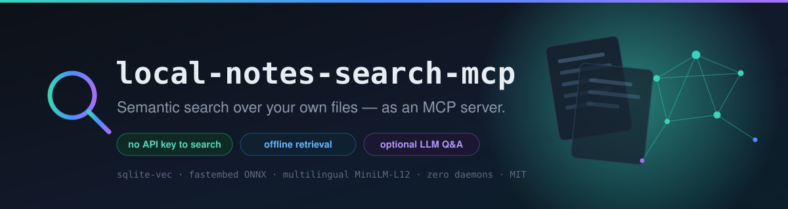
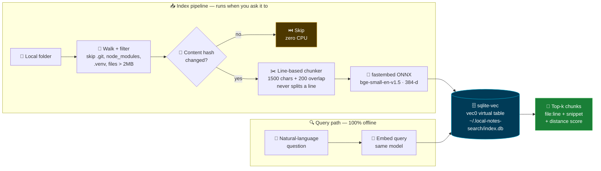

<div align="center">



# 🔎 local-notes-search-mcp

### **Semantic search over your own files — as an MCP server.**

*Ask questions in plain language instead of guessing the exact keyword you typed six months ago.*

<br/>

[](https://github.com/Furkiozknn/local-notes-search-mcp/actions/workflows/ci.yml)
[](tests/)
[](LICENSE)
[](.python-version)
[](https://modelcontextprotocol.io)

[](#-why-this-architecture)
[](#-why-this-architecture)
[](#-why-this-architecture)
[](https://github.com/asg017/sqlite-vec)
[](https://github.com/qdrant/fastembed)

<br/>

**🇹🇷 [Türkçe README →](README.tr.md)**

</div>

---

## ✨ What it does

Point it at a folder — project notes, a scattered `Claude projeler/` tree, a docs
directory — and search it by **meaning**, not by exact string match.

```text
▸ index_directory("C:/Users/you/Desktop/notes")
  ✅ 128 files indexed · 941 chunks · 12 unchanged (skipped)

▸ search_notes("what did I decide about the auth redesign?")
  🎯 3 results:

  ── notes/2026-08-decisions.md:12-24  ·  distance 0.31 ──────────────
     ## Auth redesign
     Decided: session-based instead of JWT, because the refresh-token
     rotation story was getting worse than the problem it solved...

  ── notes/meeting-2026-07-30.md:88-101  ·  distance 0.44 ────────────
     ...agreed to revisit auth after the billing migration ships.
```

Nothing in that flow touched the network. No OpenAI key, no Pinecone account,
no Docker container, no `docker compose up` before you can search your own
notes.

---

## 🧭 The 30-second pitch

| | grep / ripgrep | Cloud RAG SaaS | **local-notes-search-mcp** |
|---|:---:|:---:|:---:|
| Finds *"the auth decision"* when you wrote *"session vs JWT"* | ❌ | ✅ | ✅ |
| Works with **no API key** | ✅ | ❌ | ✅ |
| Your files **never leave the machine** | ✅ | ❌ | ✅ |
| **No server / daemon / container** to run | ✅ | ❌ | ✅ |
| Answers with exact `file:line` you can jump to | ✅ | ⚠️ | ✅ |
| Costs money per query | ✅ free | ❌ | ✅ free |
| Usable directly by Claude / any MCP client | ❌ | ⚠️ | ✅ |

---

## 🏗️ How it works



---

## 🧰 MCP tools

| 🛠️ Tool | What it does |
|---|---|
| 🗂️ **`index_directory(path, extensions=None)`** | Recursively indexes a directory. Skips `.git` / `node_modules` / `.venv` / `__pycache__` / `dist` / `build` and anything over 2 MB. Unchanged files are skipped via a cheap hash check; deleted files are purged from the index. |
| 🔍 **`search_notes(query, top_k=5, path_prefix=None)`** | Natural-language semantic search. Returns `file:line-range` + snippet + distance score — not just a bag of filenames. `path_prefix` scopes the search to one subtree. |
| 📋 **`list_indexed_files(path_prefix=None)`** | What's in the index right now: path, chunk count, last-indexed timestamp. Useful before searching, or to debug a stale result. |
| 🧹 **`remove_directory(path)`** | Drops everything under `path` from the index. **Does not delete your files** — it only cleans the index. |

---

## 🚀 Quickstart

```bash
git clone https://github.com/Furkiozknn/local-notes-search-mcp.git
cd local-notes-search-mcp
uv sync
```

<details>
<summary><b>🔌 Wire it into an MCP client (Claude Code, Claude Desktop, …)</b></summary>

<br/>

Register `local_notes_search.py` as a **stdio** MCP server:

```json
{
  "mcpServers": {
    "local-notes-search": {
      "command": "uv",
      "args": [
        "--directory", "/absolute/path/to/local-notes-search-mcp",
        "run", "local_notes_search.py"
      ]
    }
  }
}
```

On the **first** `index_directory` / `search_notes` call, the fastembed model
(~130 MB) is downloaded once and cached locally. Every call after that is fully
offline.

</details>

<details>
<summary><b>⚙️ Configuration</b></summary>

<br/>

| Env var | Default | What it does |
|---|---|---|
| `LOCAL_NOTES_SEARCH_DB` | `~/.local-notes-search/index.db` | Where the index lives. **One single file for every indexed directory** — so a single `search_notes` call can span all your project folders at once. |

Default indexed extensions: `.md` `.txt` `.py` `.js` `.ts` `.tsx` `.jsx` `.json`
`.yaml` `.yml` `.rst` `.toml` — override per call with `extensions=[...]`.

</details>

---

## 🧠 Why this architecture

| Decision | Why |
|---|---|
| 🗄️ **`sqlite-vec` (Apache-2.0)** for vector storage | A `vec0` virtual table inside one ordinary `.sqlite` file — **no daemon, no Docker, no hosted service**. Qdrant and pgvector were evaluated and rejected *specifically* because both need a running server process. A personal notes index should not require ops. |
| ⚡ **`fastembed` (Apache-2.0), not `sentence-transformers`** | Local embedding here is the **only** path — it runs on every index and every search. `sentence-transformers` drags in torch (~1 GB); that's an acceptable price for a rarely-hit fallback, but not for the hot path. fastembed's quantized ONNX models land around **100–150 MB with no torch at all**. A deliberate divergence, documented in the module docstring. |
| 🧬 **`BAAI/bge-small-en-v1.5`, 384 dims** | Small, fast, permissively licensed, general-purpose. Plenty for personal-notes scale. **No GPU required.** |
| ✂️ **Line-based chunking, no NLP/AST dependency** | Chunks accumulate whole lines until a character budget is hit — **a line is never split in half**, so every `file:line` reference the tool returns is exact. An overlap window keeps context alive across boundaries. Deterministic, and fully unit-testable without loading the embedding model. |
| 🔐 **Whole-file content-hash skip on re-index** | `index_directory` is designed to be re-run constantly. Re-embedding unchanged files would burn CPU on every single call for zero benefit — one cheap hash comparison avoids it. |

---

## 🧪 Tests

```bash
uv run pytest -v
```

> **✅ 25 / 25 tests genuinely executed and passed in this build environment** —
> both the pure-logic tests *and* the real end-to-end model + index + search
> flow. The fastembed model was really downloaded and loaded, the sqlite-vec
> extension really ran, and a *"how do I bake a cake"* query really retrieved
> the relevant file while excluding the irrelevant one.

**Two-tier test strategy.** Pure-logic tests (chunking, hashing, file walking)
always run. Tests that need the real fastembed model or the sqlite-vec
extension **skip honestly** when those can't be loaded in the environment — an
offline runner, a missing dependency — rather than faking a green result.

---

## ⚠️ Known limitations

Written down on purpose, because a README that claims no weaknesses is a README
you shouldn't trust.

- **BGE's asymmetric query-instruction prefix isn't used.** Models like
  `bge-small-en-v1.5` recommend embedding the *query* with an instruction
  prefix (`"Represent this sentence for searching relevant passages: "`),
  distinct from how documents are embedded. This tool embeds both the same
  way — a conscious v1 simplification that costs some retrieval quality.
  fastembed's model-specific API surface for this (`query_embed`-style) was
  **not** used from memory without live verification.
- **CI re-downloads the fastembed model on every run** (no `actions/cache`
  configured). Acceptable for a small project; easy to speed up later. Low
  priority, and honestly labelled as not done.
- **Single-writer SQLite.** Concurrent `index_directory` / `search_notes` calls
  from *separate processes* can collide on writes. The tool is designed around
  a single MCP client session.

---

## 📜 License

[MIT](LICENSE) — and every runtime dependency was license-checked:
`sqlite-vec` (Apache-2.0), `fastembed` (Apache-2.0), `mcp` (MIT).
No non-commercial or field-restricted weights anywhere in the stack.

<div align="center">
<br/>

**Built as part of an ecosystem of small, focused, self-hostable AI tools.**

</div>
