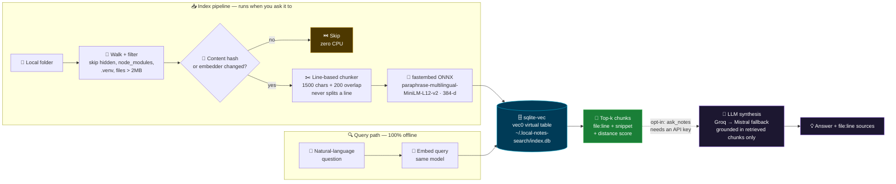
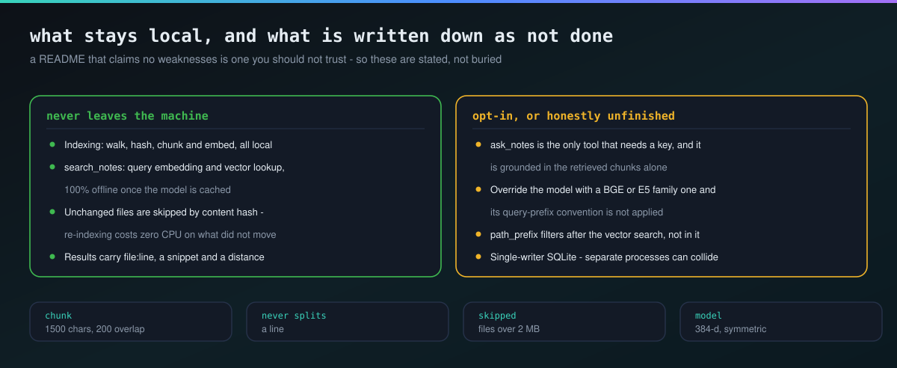

<div align="center">


# 🔎 local-notes-search-mcp

### **Semantic search over your own files — as an MCP server.**

*Ask questions in plain language instead of guessing the exact keyword you typed six months ago.*

<br/>

[](https://github.com/Furkiozknn/local-notes-search-mcp/actions/workflows/ci.yml)
[](tests/)
[](LICENSE)
[](.python-version)
[](https://modelcontextprotocol.io)

**🇹🇷 [Türkçe README →](README.tr.md)**

</div>

---

## Try it in a minute

```bash
git clone https://github.com/Furkiozknn/local-notes-search-mcp.git
cd local-notes-search-mcp
uv sync && uv run python examples/stdio_demo.py
```

That starts the server, talks to it over stdio the way an MCP client does, and
searches the fixture notes in [`examples/notes/`](examples/notes/) — five short
files written for this repository, **not anyone's real notes** — into a
throwaway index in a temp directory. Nothing in `~/.local-notes-search` is
touched. Measured on the author's machine (Windows 11, Python 3.12, uv 0.12.5,
30 September 2026): `uv sync` with an empty uv cache 22 s, the one-time model
download about 20 s, the demo itself about 19 s. The first run needs network for
that download; see [the model download](#-quickstart) if you want it as an
explicit step.

<p align="center"></p>
<p align="center"><sub>Real output, replayed. <a href="docs/demo/demo.mp4">MP4</a> · <a href="docs/demo/komutlar.txt">the plain-text record</a> (command, output, exit code) · regenerate with <code>python scripts/demo-uret.py</code></sub></p>

The part of that output that matters (verbatim; the tools answer in Turkish, the
author's working language, and `distance` is the sqlite-vec default L2 distance — lower is
closer, and it is not a 0–1 score):

```text
examples/notes indexlendi: 5 dosya (yeni/değişmiş), 0 değişmemiş dosya atlandı, 5 yeni chunk, 0 silinmiş dosya temizlendi.

search_notes("what did I decide about the auth redesign?", top_k=2)
2 sonuç:

--- examples/notes/2026-08-decisions.md:1-10 (distance=4.5000) ---
# Decisions, August 2026

## Auth redesign
Decided: session cookies instead of JWT. The refresh-token rotation story was
getting worse than the problem it solved, and every client we ship is a browser.
[...]

--- examples/notes/meeting-2026-07-30.md:1-7 (distance=5.0842) ---
# Meeting, 30 July
[...]
- Agreed to revisit the login flow after the billing migration ships.
```

The query says "auth redesign"; the note says "session cookies instead of JWT".
The second pasta query in the full record finds a Turkish note for an English
question, which is what the multilingual model is for.

### When to use it, and when not to

| Use it when | Do not use it when |
|---|---|
| you remember *what* a note said but not the words you typed | you know the exact string: `ripgrep` is faster and exact |
| you want your MCP client (Claude Code, Claude Desktop, …) to search your own folders with `file:line` answers | you need a shared, multi-user or hosted index: this is one local SQLite file, single writer |
| the notes must not leave the machine and you have no API key to give | you need the ranking to be tuned per corpus: one fixed embedding model, no re-ranking |
| Turkish, English or mixed notes | your files are PDFs, Word or images: only text formats are read ([list](#-quickstart)) |

<p align="center">

[](#-why-this-architecture)
[](#-why-this-architecture)
[](#-why-this-architecture)
[](#-mcp-tools)
[](https://github.com/asg017/sqlite-vec)
[](https://github.com/qdrant/fastembed)

</p>

Want a synthesized answer instead of a result list? 💡 **`ask_notes`** runs the
exact same retrieval, then has an LLM answer *grounded only in the retrieved
chunks*, with `file:line` sources attached. It's strictly **opt-in** — set
`GROQ_API_KEY` or `MISTRAL_API_KEY` and it synthesizes; set neither and it
quietly returns the raw matches instead of failing.

Indexing and search need no API key, no Docker container and no daemon. The one
network call they can make is the one-time model download.

---

## 🧭 The 30-second pitch

| | grep / ripgrep | Cloud RAG SaaS | **local-notes-search-mcp** |
|---|:---:|:---:|:---:|
| Finds *"the auth decision"* when you wrote *"session vs JWT"* | ❌ | ✅ | ✅ |
| Works with **no API key** | ✅ | ❌ | ✅ |
| Your files **never leave the machine** | ✅ | ❌ | ✅ |
| **No server / daemon / container** to run | ✅ | ❌ | ✅ |
| Answers with exact `file:line` you can jump to | ✅ | ⚠️ | ✅ |
| Costs money per query | ✅ free | ❌ | ✅ free |
| Usable directly by Claude / any MCP client | ❌ | ⚠️ | ✅ |
| Optional grounded LLM answer with sources | ❌ | ✅ | ✅ opt-in |

---

## 🏗️ How it works


```mermaid
flowchart LR
    subgraph INDEX["📥 Index pipeline — runs when you ask it to"]
        direction LR
        A["📁 Local folder"] --> B["🚶 Walk + filter<br/>skip hidden, node_modules,<br/>.venv, files &gt; 2MB"]
        B --> H{"🔐 Content hash<br/>or embedder changed?"}
        H -- "no" --> SKIP["⏭️ Skip<br/>zero CPU"]
        H -- "yes" --> C["✂️ Line-based chunker<br/>1500 chars + 200 overlap<br/>never splits a line"]
        C --> D["🧠 fastembed ONNX<br/>paraphrase-multilingual-MiniLM-L12-v2 · 384-d"]
    end

    D --> DB[("🗄️ sqlite-vec<br/>vec0 virtual table<br/>~/.local-notes-search/index.db")]

    subgraph QUERY["🔍 Query path — 100% offline"]
        direction LR
        Q["💬 Natural-language<br/>question"] --> QE["🧠 Embed query<br/>same model"]
    end

    QE --> DB
    DB --> R["🎯 Top-k chunks<br/>file:line + snippet<br/>+ distance score"]

    R -. "opt-in: ask_notes<br/>needs an API key" .-> LLM["🤖 LLM synthesis<br/>Groq → Mistral fallback<br/>grounded in retrieved chunks only"]
    LLM --> ANS["💡 Answer + file:line sources"]

    style LLM fill:#1c1730,stroke:#a371f7,color:#ffffff
    style ANS fill:#1c1730,stroke:#a371f7,color:#ffffff
    style DB fill:#003b57,stroke:#00b4d8,color:#ffffff
    style R fill:#1a7f37,stroke:#3fb950,color:#ffffff
    style SKIP fill:#4d3800,stroke:#d4a72c,color:#ffffff
```

---

## 🧰 MCP tools

| 🛠️ Tool | What it does |
|---|---|
| 🗂️ **`index_directory(path, extensions=None)`** | Recursively indexes a directory. Skips hidden files and directories (`.git`, `.ssh`, `.config`, `.claude.json`, …), `node_modules` / `venv` / `__pycache__` / `dist` / `build`, binary files, anything that is not a regular file, and anything over 2 MB. Unchanged files are skipped via a cheap hash check — unless a different model or fastembed version embedded them, then they are re-embedded; deleted (or no-longer-readable) files are purged from the index. |
| 🔍 **`search_notes(query, top_k=5, path_prefix=None)`** | Natural-language semantic search. Returns `file:line-range` + snippet + distance score — not just a bag of filenames. `path_prefix` scopes the search to one subtree. `top_k` is 1–50. |
| 💡 **`ask_notes(question, top_k=5, path_prefix=None)`** | *Optional.* Same retrieval as `search_notes`, then an LLM (Groq → Mistral fallback) answers using **only** those chunks, followed by a `file:line` source list. Needs `GROQ_API_KEY` or `MISTRAL_API_KEY`. With neither key set — or if the provider chain fails — it degrades to returning the raw matches with a note. It never hard-fails just because synthesis wasn't possible. |
| 📋 **`list_indexed_files(path_prefix=None)`** | What's in the index right now: path, chunk count, last-indexed timestamp (first 200 files, with a count of the rest), and a marker on files embedded by another model/fastembed version. Useful before searching, or to debug a stale result. |
| 🧹 **`remove_directory(path)`** | Drops everything under `path` from the index. **Does not delete your files** — it only cleans the index. |

> 🔒 **`index_directory`, `search_notes`, `list_indexed_files` and `remove_directory`
> require no API key and send nothing anywhere.** The one network call they can
> make is the one-time embedding-model download described under Quickstart —
> set `LOCAL_NOTES_SEARCH_OFFLINE=1` to rule even that out. `ask_notes` is the
> one tool that can talk to a remote provider, and only when you explicitly
> give it a key.

---

## 🚀 Quickstart

Needs [uv](https://docs.astral.sh/uv/) and Python 3.10–3.13.

```bash
git clone https://github.com/Furkiozknn/local-notes-search-mcp.git
cd local-notes-search-mcp
uv sync
```

The demo above is the quickest check that everything works. If the model cannot be
downloaded it prints an error naming the fix (network access, or
`--download-model` + `LOCAL_NOTES_SEARCH_OFFLINE`); `uv run local-notes-search-mcp --help`
lists the tools, the environment variables and the default paths.

<details>
<summary><b>🔌 Wire it into an MCP client (Claude Code, Claude Desktop, …)</b></summary>

<br/>

Register `local_notes_search.py` as a **stdio** MCP server:

```json
{
  "mcpServers": {
    "local-notes-search": {
      "command": "uv",
      "args": [
        "--directory", "/absolute/path/to/local-notes-search-mcp",
        "run", "local_notes_search.py"
      ]
    }
  }
}
```

**The model download, stated plainly.** The embedding model is not bundled.
Unless it is already cached, the first `index_directory` / `search_notes` call
downloads it from Hugging Face (fastembed lists it at 0.22 GB) into
`~/.local-notes-search/models`, and every call after that is offline. To make
that download an explicit step instead of a side effect:

```bash
uv run local-notes-search-mcp --download-model   # once, with network
export LOCAL_NOTES_SEARCH_OFFLINE=1              # from now on: never download
```

With `LOCAL_NOTES_SEARCH_OFFLINE=1` and no cached model, a tool call fails with
an error that says exactly this, instead of reaching for the network.

</details>

<details>
<summary><b>⚙️ Configuration</b></summary>

<br/>

| Env var | Default | What it does |
|---|---|---|
| `LOCAL_NOTES_SEARCH_DB` | `~/.local-notes-search/index.db` | Where the index lives. **One single file for every indexed directory** — so a single `search_notes` call can span all your project folders at once. |
| `LOCAL_NOTES_SEARCH_MODEL` | `sentence-transformers/paraphrase-multilingual-MiniLM-L12-v2` | Embedding model (any fastembed-supported name). An index built with another model is refused, not silently compared. |
| `LOCAL_NOTES_SEARCH_MODEL_DIR` | `~/.local-notes-search/models` | Model cache. Falls back to `FASTEMBED_CACHE_PATH` if that is set. (fastembed's own default is the system temp directory, which is wiped on reboot — hence a download again later.) |
| `LOCAL_NOTES_SEARCH_OFFLINE` | *unset* | `1` forbids any model download; the model must already be cached (`--download-model`). |
| `LOCAL_NOTES_SEARCH_ALLOWED_ROOTS` | *unset* | Optional allowlist. When set, `index_directory` refuses any path that does not resolve inside one of these directories. `os.pathsep`-separated (`:` on Linux/macOS, `;` on Windows). |
| `GROQ_API_KEY` | *unset* | Optional. Enables `ask_notes` synthesis via Groq (first in the provider chain). |
| `MISTRAL_API_KEY` | *unset* | Optional. Fallback provider for `ask_notes` when Groq is unset or fails. |

Keys are read from the environment only — **never commit them, and never put
them in the MCP client config file you check into git.**

Default indexed extensions: `.md` `.txt` `.py` `.js` `.ts` `.tsx` `.jsx` `.json`
`.yaml` `.yml` `.rst` `.toml` — override per call with `extensions=[...]`.

### 🔒 What can be indexed

`index_directory` reads whatever it is pointed at, and `ask_notes` sends the
chunks it retrieves to a **third-party LLM** (Groq or Mistral) when a key is
configured. So an indexed path is a path whose contents can leave the machine.
These guards exist:

**1. `LOCAL_NOTES_SEARCH_ALLOWED_ROOTS` (opt-in).** Unset by default — that is
the historical behaviour, any directory the running user can read is
indexable, and this project does not pretend an empty default is a sandbox.
Set it and `index_directory` refuses anything outside:

```bash
export LOCAL_NOTES_SEARCH_ALLOWED_ROOTS="$HOME/notes:$HOME/projects"
```

Paths are resolved (`..` collapsed, symlinks followed) before the check, and a
subdirectory of an allowed root is allowed. A configured entry that is not a
directory is an error rather than being silently dropped — a typo must not
quietly switch the allowlist off.

**2. A credential-filename denylist (always on).** These are never indexed,
whatever the allowlist or the `extensions=[...]` argument says:

`.env` · `.env.*` · `.netrc` · `_netrc` · `id_rsa` · `id_dsa` · `id_ecdsa` ·
`id_ed25519` · `credentials.json` · `secrets.json` · `service-account*.json` ·
`.npmrc` · `.pypirc` · `.git-credentials` · `*.pem` · `*.key` · `*.p12` ·
`*.pfx` · `*.ppk`

Matching is case-insensitive. It is a **name** denylist, not a secret scanner:
it stops the obvious cases (`credentials.json` would otherwise sail through the
default `.json` extension filter), not a key pasted into a `.md` file.

**3. Hidden files and directories are not walked (always on).** `.ssh`,
`.aws`, `.gnupg`, `.docker` (whose `config.json` holds registry auth),
`.config` (where `gh` keeps an OAuth token in `hosts.yml`), `~/.claude.json`
(MCP server configs, API keys in `env` included) — pointing `index_directory`
at a home directory must not sweep those in through the `.json` / `.yml`
filters. A hidden directory you *do* want indexed can be passed as `path`
itself. Only regular files are read: a FIFO or device named `*.md` is skipped
(a FIFO used to hang the whole call), and a file is never read past 2 MB even
if it grew after the walk.

**4. Symlinks cannot leave the root (always on).** A symlinked file is indexed
only if it resolves to a regular file inside the directory being indexed, not
inside a skipped directory, and not to a denylisted name — so
`notes/todo.md → ~/.aws/credentials` is skipped instead of being read under an
innocent name, past both the denylist and the allowlist. Directory symlinks are
never followed.

### 🗄️ What the index stores

The index file holds, for every indexed chunk, its **full text in plain
text**, its path and line range, and its vector. It is a copy of your notes,
not just pointers to them. On Linux/macOS it is created owner-only (`0600`,
inside a `0700` `~/.local-notes-search/`; an index created by an older version
is tightened the next time it is opened). Delete it — or use
`remove_directory` — and the copy is gone; your original files are never
modified.

Every indexed file also records **which embedder produced its vectors**: the
model name *and* the fastembed version. That matters because fastembed 0.6.0
changed this model's pooling (CLS → mean), so vectors from before and after
are not comparable. After an upgrade, `search_notes` / `ask_notes` start with
a warning that says how many files are stale, `list_indexed_files` marks them,
and the next `index_directory` on those folders re-embeds them even though
their content did not change. An index created before this was recorded is
treated the same way.

</details>

---

## 🧠 Why this architecture

| Decision | Why |
|---|---|
| 🗄️ **`sqlite-vec` (Apache-2.0)** for vector storage | A `vec0` virtual table inside one ordinary `.sqlite` file — **no daemon, no Docker, no hosted service**. Qdrant and pgvector were evaluated and rejected *specifically* because both need a running server process. A personal notes index should not require ops. |
| ⚡ **`fastembed` (Apache-2.0), not `sentence-transformers`** | Local embedding here is the **only** path — it runs on every index and every search. `sentence-transformers` drags in torch (~1 GB); that's an acceptable price for a rarely-hit fallback, but not for the hot path. fastembed's quantized ONNX models land around **100–150 MB with no torch at all**. A deliberate divergence, documented in the module docstring. |
| 🧬 **`paraphrase-multilingual-MiniLM-L12-v2`, 384 dims** | Small (0.22 GB), Apache-2.0, and — decisive for this tool — **actually multilingual**: the previous `bge-small-en-v1.5` was an English-only model quietly embedding Turkish notes. Symmetric, so queries and passages embed identically. Override with `LOCAL_NOTES_SEARCH_MODEL`; a mismatched existing index is refused, never silently compared. **No GPU required.** |
| ✂️ **Line-based chunking, no NLP/AST dependency** | Chunks accumulate whole lines until a character budget is hit — **a line is never split in half**, so every `file:line` reference the tool returns is exact. An overlap window keeps context alive across boundaries. Deterministic, and fully unit-testable without loading the embedding model. |
| 🔐 **Whole-file content-hash skip on re-index** | `index_directory` is designed to be re-run constantly. Re-embedding unchanged files would burn CPU on every single call for zero benefit — one cheap hash comparison avoids it. |

---

## 🧪 Tests

```bash
uv run pytest -v
```

**99 tests, on a deliberate two-tier strategy.** Pure-logic tests (chunking,
hashing, file walking, `ask_notes`' provider-chain and degradation paths)
always run — no model, no network, no API key. Tests that need the real
fastembed model or the sqlite-vec extension **skip honestly** when those can't
be loaded — an offline runner, a blocked model download — rather than faking a
green result.

What that means in practice, reported exactly as measured:

| Environment | Result |
|---|---|
| ✅ CI (model cached, and *required*: a missing model fails the job instead of skipping; Python 3.10, 3.11, 3.12 and 3.13) | **99 passed** on each of the four — measured 25 September 2026 — including the real end-to-end flow — the fastembed model really loaded, the sqlite-vec extension really ran, and a *"how do I cook pasta"* query really retrieved the recipe note and not the car-maintenance one. |
| ⚠️ A sandbox with the model download blocked | **85 passed, 14 skipped** — measured 25 September 2026. Every model-free test green, and the model-backed ones skipped with an explicit reason instead of a false pass. |

The second row is the honest cost of the first: this suite tells you when it
*couldn't* verify something.

---

## What this server can actually do

The expensive question about an MCP server is not what it promises but what it
**can do on your machine**: which credentials it can touch, where it connects,
what it runs. Answering that means reading the source, and most people will not.

On every push, [mcp-vet](https://github.com/Furkiozknn/mcp-vet) from the same
account audits this server from source and writes the whole report into the job
summary, verdict included. The gate closes at HIGH and
above — and it also closes if the tool itself could not run, because "I could not
look" should not read as green.

Auditing our own server with our own tool had a side effect worth recording: adding
this job surfaced a real false positive in mcp-vet, which was fixed. A tool nobody
runs stays right by default.

## ⚠️ Known limitations



Written down on purpose, because a README that claims no weaknesses is a README
you shouldn't trust.

- **No query-instruction prefix is needed anymore.** The previous
  English-only `bge-small-en-v1.5` recommended embedding queries with an
  instruction prefix, which this tool skipped as a v1 simplification. The
  current default, `paraphrase-multilingual-MiniLM-L12-v2`, is a symmetric
  model: queries and passages are *meant* to embed identically, so the
  simplification is now simply the correct usage. If you override
  `LOCAL_NOTES_SEARCH_MODEL` with an asymmetric model (BGE/E5 family),
  know that its prefix convention is still not applied.
- **`path_prefix` filters after the vector search, not inside it.** The
  search over-fetches `4 × top_k` nearest chunks from the whole index and then
  keeps those under the prefix, so a narrow prefix in a large index can return
  fewer than `top_k` results even when more matching chunks exist.
- **Single-writer SQLite.** Concurrent `index_directory` / `search_notes` calls
  from *separate processes* can collide on writes. The tool is designed around
  a single MCP client session.

---

## 📓 Changelog

See [CHANGELOG.md](CHANGELOG.md).

## 📜 License

[MIT](LICENSE) — and every runtime dependency was license-checked:
`sqlite-vec` (Apache-2.0), `fastembed` (Apache-2.0), `mcp` (MIT),
`litellm` (MIT). No non-commercial or field-restricted weights anywhere in
the stack.

<div align="center">
<br/>

**Built as part of an ecosystem of small, focused, self-hostable AI tools.**

</div>

---

## More from this ecosystem

- **[mini-creative-toolkit](https://github.com/Furkiozknn/mini-creative-toolkit)** — 23 CPU-first media tools behind one MCP server
- **[nvidia-nim-mcp](https://github.com/Furkiozknn/nvidia-nim-mcp)** — seven MCP tools on NVIDIA NIM's free tier
- **[voice-io-mcp](https://github.com/Furkiozknn/voice-io-mcp)** — speech in and out, needing no API key
- **[mcp-vet](https://github.com/Furkiozknn/mcp-vet)** — audits an MCP server's source before you install it

<sub>All of them in one searchable page: **[furkiozknn.github.io](https://furkiozknn.github.io/)** — each card is generated from that repository's own <code>project-meta.json</code>.</sub>

<!-- mcp-name: io.github.Furkiozknn/local-notes-search-mcp -->
