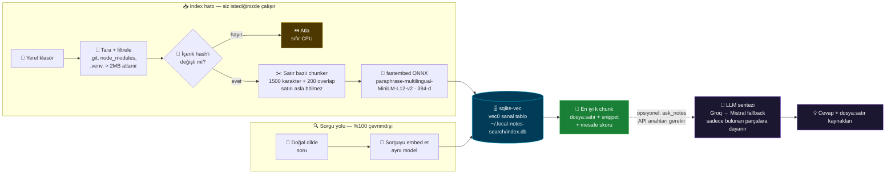

<div align="center">


# 🔎 local-notes-search-mcp

### **Kendi dosyalarınızda anlamsal arama — bir MCP sunucusu olarak.**

*Altı ay önce tam olarak hangi kelimeyi yazdığınızı hatırlamaya çalışmak yerine, doğal dilde sorun.*

<br/>

[](https://github.com/Furkiozknn/local-notes-search-mcp/actions/workflows/ci.yml)
[](tests/)
[](LICENSE)
[](.python-version)
[](https://modelcontextprotocol.io)

[](#-neden-bu-mimari)
[](#-neden-bu-mimari)
[](#-neden-bu-mimari)
[](#-mcp-ara%C3%A7lar%C4%B1)
[](https://github.com/asg017/sqlite-vec)
[](https://github.com/qdrant/fastembed)

<br/>

**🇬🇧 [English README →](README.md)**

</div>

---

## ✨ Ne yapar

Bir klasörü gösterin — proje notlarınız, dağınık bir `Claude projeler/` ağacı,
bir dokümantasyon dizini — ve içinde **anlama göre** arayın, birebir kelime
eşleşmesine göre değil.

```text
▸ index_directory("C:/Users/siz/Desktop/notlar")
  ✅ 128 dosya indexlendi · 941 chunk · 12 değişmemiş (atlandı)

▸ search_notes("auth yeniden tasarımı hakkında ne karar vermiştim?")
  🎯 3 sonuç:

  ── notlar/2026-08-kararlar.md:12-24  ·  mesafe 0.31 ────────────────
     ## Auth yeniden tasarımı
     Kararlaştırdık: JWT yerine session-based, çünkü refresh-token
     rotasyonu çözdüğü problemden daha kötü hale gelmişti...

  ── notlar/toplanti-2026-07-30.md:88-101  ·  mesafe 0.44 ────────────
     ...auth konusunu billing migration bittikten sonra tekrar açacağız.
```

Bu akışın hiçbir adımı ağa çıkmadı. OpenAI anahtarı yok, Pinecone hesabı yok,
Docker konteyneri yok, kendi notlarınızda arama yapmak için önce
`docker compose up` yazmanız gerekmiyor.

Sonuç listesi yerine sentezlenmiş bir cevap mı istiyorsunuz? 💡 **`ask_notes`**
tam olarak aynı retrieval'ı çalıştırır, ardından bir LLM'e *sadece bulunan
parçalara dayanarak* cevap verdirir ve `dosya:satır` kaynaklarını ekler.
Tamamen **opsiyoneldir** — `GROQ_API_KEY` ya da `MISTRAL_API_KEY` ayarlıysa
sentezler; hiçbiri yoksa hata vermeden ham eşleşmeleri döner.

---

## 🧭 30 saniyelik özet

| | grep / ripgrep | Bulut RAG SaaS | **local-notes-search-mcp** |
|---|:---:|:---:|:---:|
| *"session vs JWT"* yazdığınızda *"auth kararı"*nı bulur | ❌ | ✅ | ✅ |
| **API anahtarı olmadan** çalışır | ✅ | ❌ | ✅ |
| Dosyalarınız **makineden hiç çıkmaz** | ✅ | ❌ | ✅ |
| Çalıştırılacak **sunucu / daemon / konteyner yok** | ✅ | ❌ | ✅ |
| Doğrudan atlayabileceğiniz `dosya:satır` döner | ✅ | ⚠️ | ✅ |
| Sorgu başına para harcar | ✅ ücretsiz | ❌ | ✅ ücretsiz |
| Claude / herhangi bir MCP istemcisi doğrudan kullanabilir | ❌ | ⚠️ | ✅ |
| Kaynaklı, temellendirilmiş LLM cevabı | ❌ | ✅ | ✅ opsiyonel |

---

## 🏗️ Nasıl çalışır



---

## 🧰 MCP araçları

| 🛠️ Araç | Ne yapar |
|---|---|
| 🗂️ **`index_directory(path, extensions=None)`** | Bir dizini recursive indexler. Gizli dizinler (`.git`, `.ssh`, `.config`, …), `node_modules` / `venv` / `__pycache__` / `dist` / `build`, ikili dosyalar ve 2 MB üzeri dosyalar atlanır. Değişmemiş dosyalar ucuz bir hash kontrolüyle atlanır; silinmiş (ya da artık okunamayan) dosyalar index'ten temizlenir. |
| 🔍 **`search_notes(query, top_k=5, path_prefix=None)`** | Doğal dilde anlamsal arama. `dosya:satır-aralığı` + snippet + mesafe skoru döner — sadece bir dosya adı yığını değil. `path_prefix` aramayı tek bir alt ağaca daraltır. `top_k` 1–50 arası. |
| 💡 **`ask_notes(question, top_k=5, path_prefix=None)`** | *Opsiyonel.* `search_notes` ile aynı retrieval, ardından bir LLM (Groq → Mistral fallback) **sadece** o parçaları kullanarak cevap üretir ve altına `dosya:satır` kaynak listesi ekler. `GROQ_API_KEY` ya da `MISTRAL_API_KEY` gerekir. İkisi de yoksa — ya da sağlayıcı zinciri başarısız olursa — ham eşleşmeleri bir notla döner. Sentez mümkün olmadı diye asla sert bir hata vermez. |
| 📋 **`list_indexed_files(path_prefix=None)`** | Şu an index'te ne var: yol, chunk sayısı, son indexlenme zamanı (ilk 200 dosya, kalanların sayısıyla). Aramadan önce kapsamı görmek ya da bayat bir sonucu debug etmek için. |
| 🧹 **`remove_directory(path)`** | `path` altındaki her şeyi index'ten düşürür. **Dosyalarınızı silmez** — sadece index'i temizler. |

> 🔒 **`index_directory`, `search_notes`, `list_indexed_files` ve `remove_directory`
> hiçbir API anahtarı istemez ve hiçbir yere veri göndermez.** Yapabilecekleri
> tek ağ çağrısı, Hızlı başlangıç'ta anlatılan tek seferlik model indirmesidir
> — onu da `LOCAL_NOTES_SEARCH_OFFLINE=1` ile tamamen kapatabilirsiniz. Uzak bir
> sağlayıcıyla konuşabilen tek araç `ask_notes`, o da yalnızca siz açıkça bir
> anahtar verdiğinizde.

---

## 🚀 Hızlı başlangıç

```bash
git clone https://github.com/Furkiozknn/local-notes-search-mcp.git
cd local-notes-search-mcp
uv sync
```

<details>
<summary><b>🔌 MCP istemcinize bağlayın (Claude Code, Claude Desktop, …)</b></summary>

<br/>

`local_notes_search.py`'yi **stdio** MCP sunucusu olarak tanımlayın:

```json
{
  "mcpServers": {
    "local-notes-search": {
      "command": "uv",
      "args": [
        "--directory", "/mutlak/yol/local-notes-search-mcp",
        "run", "local_notes_search.py"
      ]
    }
  }
}
```

**Model indirmesi, açıkça.** Embedding modeli pakete gömülü değil. Önbellekte
yoksa ilk `index_directory` / `search_notes` çağrısı onu Hugging Face'ten
(fastembed'in listesinde 0.22 GB) `~/.local-notes-search/models` içine indirir;
sonraki tüm çağrılar çevrimdışıdır. Bu indirmeyi bir yan etki değil, açık bir
adım yapmak için:

```bash
uv run local-notes-search-mcp --download-model   # bir kez, ağ varken
export LOCAL_NOTES_SEARCH_OFFLINE=1              # bundan sonra: asla indirme
```

`LOCAL_NOTES_SEARCH_OFFLINE=1` ayarlıyken model önbellekte yoksa araç ağa
çıkmak yerine tam olarak bunu söyleyen bir hatayla durur.

</details>

<details>
<summary><b>⚙️ Yapılandırma</b></summary>

<br/>

| Ortam değişkeni | Varsayılan | Ne işe yarar |
|---|---|---|
| `LOCAL_NOTES_SEARCH_DB` | `~/.local-notes-search/index.db` | Index'in konumu. **Tüm indexlenen dizinler için TEK bir dosya** — böylece tek bir `search_notes` çağrısı bütün proje klasörlerinizi birden tarayabilir. |
| `LOCAL_NOTES_SEARCH_MODEL` | `sentence-transformers/paraphrase-multilingual-MiniLM-L12-v2` | Embedding modeli (fastembed'in desteklediği herhangi bir ad). Başka modelle kurulmuş bir index sessizce karşılaştırılmaz, reddedilir. |
| `LOCAL_NOTES_SEARCH_MODEL_DIR` | `~/.local-notes-search/models` | Model önbelleği. Ayarlıysa `FASTEMBED_CACHE_PATH`'e düşer. (fastembed'in kendi varsayılanı sistemin geçici dizini — yeniden başlatmada silinir ve model sonra tekrar indirilir.) |
| `LOCAL_NOTES_SEARCH_OFFLINE` | *ayarsız* | `1` her türlü model indirmesini yasaklar; model önceden önbellekte olmalı (`--download-model`). |
| `LOCAL_NOTES_SEARCH_ALLOWED_ROOTS` | *ayarsız* | Opsiyonel izin listesi. Ayarlandığında `index_directory`, bu dizinlerin içine çözülmeyen hiçbir yolu kabul etmez. `os.pathsep` ile ayrılır (Linux/macOS'ta `:`, Windows'ta `;`). |
| `GROQ_API_KEY` | *ayarsız* | Opsiyonel. `ask_notes` sentezini Groq üzerinden açar (zincirdeki ilk sağlayıcı). |
| `MISTRAL_API_KEY` | *ayarsız* | Opsiyonel. Groq ayarsızsa ya da başarısız olursa `ask_notes` için fallback sağlayıcı. |

Anahtarlar yalnızca ortam değişkeninden okunur — **asla commit etmeyin ve git'e
girecek bir MCP istemci config dosyasına yazmayın.**

Varsayılan indexlenen uzantılar: `.md` `.txt` `.py` `.js` `.ts` `.tsx` `.jsx`
`.json` `.yaml` `.yml` `.rst` `.toml` — çağrı başına `extensions=[...]` ile
değiştirilebilir.

### 🔒 Ne indexlenebilir

`index_directory` kendisine verilen her yolu okur; `ask_notes` ise bir anahtar
yapılandırılmışsa getirdiği parçaları **üçüncü taraf bir LLM'e** (Groq ya da
Mistral) gönderir. Yani indexlenen bir yol, içeriği makineden çıkabilecek bir
yoldur. Şu korumalar var:

**1. `LOCAL_NOTES_SEARCH_ALLOWED_ROOTS` (opsiyonel).** Varsayılan olarak
ayarsız — yani eski davranış: kullanıcının okuyabildiği her dizin
indexlenebilir. Boş bir varsayılan bir kum havuzu değildir ve bu proje öyle
olduğunu iddia etmez. Ayarladığınızda `index_directory` dışarıdaki her yolu
reddeder:

```bash
export LOCAL_NOTES_SEARCH_ALLOWED_ROOTS="$HOME/notlar:$HOME/projeler"
```

Yollar kontrolden önce çözülür (`..` sadeleştirilir, sembolik bağlantılar
izlenir) ve izin verilen bir kökün alt dizini de kabul edilir. Dizin olmayan
bir giriş sessizce atılmak yerine hata verir — bir yazım hatası izin listesini
sessizce kapatmamalı.

**2. Kimlik bilgisi dosya adı kara listesi (her zaman açık).** Aşağıdakiler izin
listesinden ya da `extensions=[...]` argümanından bağımsız olarak asla
indexlenmez:

`.env` · `.env.*` · `.netrc` · `_netrc` · `id_rsa` · `id_dsa` · `id_ecdsa` ·
`id_ed25519` · `credentials.json` · `secrets.json` · `service-account*.json` ·
`.npmrc` · `.pypirc` · `.git-credentials` · `*.pem` · `*.key` · `*.p12` ·
`*.pfx` · `*.ppk`

Eşleşme büyük/küçük harf duyarsızdır. Bu bir **ad** kara listesidir, gizli
bilgi tarayıcısı değil: bariz durumları engeller (`credentials.json` aksi halde
varsayılan `.json` uzantı filtresinden geçerdi), bir `.md` dosyasına
yapıştırılmış anahtarı değil.

**3. Gizli dizinler taranmaz (her zaman açık).** `.ssh`, `.aws`, `.gnupg`,
`.docker` (`config.json` registry kimlik bilgisini tutar), `.config` (`gh`
OAuth jetonunu `hosts.yml`'de saklar) — `index_directory`'yi ev dizinine
yöneltmek bunları `.json` / `.yml` filtresinden içeri almamalı. Gerçekten
indexlemek istediğiniz gizli bir dizini doğrudan `path` olarak verebilirsiniz.

**4. Sembolik bağlantılar kökten çıkamaz (her zaman açık).** Sembolik bağlantı
olan bir dosya, yalnızca indexlenen dizinin içinde, atlanan bir dizinde olmayan
ve kara listedeki bir ada sahip olmayan normal bir dosyaya çözülüyorsa
indexlenir — yani `notlar/todo.md → ~/.aws/credentials` masum bir adla
okunmak yerine atlanır; ne kara listeyi ne izin listesini delebilir. Dizin
bağlantıları hiç izlenmez.

### 🗄️ Index'te ne saklanıyor

Index dosyası, indexlenen her chunk için **tam metnini düz metin olarak**,
yolunu, satır aralığını ve vektörünü tutar. Notlarınıza işaret eden bir liste
değil, notlarınızın bir kopyasıdır. Linux/macOS'ta yalnızca sahibi okuyabilecek
şekilde oluşturulur (`0600`, `0700` bir `~/.local-notes-search/` içinde; eski
bir sürümün oluşturduğu index bir sonraki açılışta sıkılaştırılır). Dosyayı
silin — ya da `remove_directory` kullanın — kopya gider; asıl dosyalarınıza
hiçbir zaman dokunulmaz.

</details>

---

## 🧠 Neden bu mimari

| Karar | Neden |
|---|---|
| 🗄️ **Vektör depolama için `sqlite-vec` (Apache-2.0)** | Sıradan tek bir `.sqlite` dosyasının içinde bir `vec0` sanal tablosu — **daemon yok, Docker yok, hosted servis yok**. Qdrant ve pgvector değerlendirildi ve *tam olarak* ikisi de çalışan bir sunucu süreci gerektirdiği için elendi. Kişisel bir not index'i ops gerektirmemeli. |
| ⚡ **`sentence-transformers` değil, `fastembed` (Apache-2.0)** | Burada yerel embedding **tek** yol — her index ve her aramada çalışıyor. `sentence-transformers` torch'u (~1 GB) beraberinde getiriyor; bu, nadiren çalışan bir fallback için kabul edilebilir bir bedel, ama sıcak yol için değil. fastembed'in kuantize ONNX modelleri **torch olmadan ~100–150 MB** bandında kalıyor. Bilinçli bir ayrışma, modül docstring'inde belgelendi. |
| 🧬 **`paraphrase-multilingual-MiniLM-L12-v2`, 384 boyut** | Küçük (0.22 GB), Apache-2.0 ve — bu araç için belirleyici olan — **gerçekten çok dilli**: önceki `bge-small-en-v1.5` yalnızca İngilizce bir modeldi ve Türkçe notları sessizce embed ediyordu. Simetrik: sorgu ve metin aynı şekilde embed edilir. `LOCAL_NOTES_SEARCH_MODEL` ile değiştirilebilir; farklı modelle kurulmuş bir index sessizce karşılaştırılmaz, reddedilir. **GPU gerekmiyor.** |
| ✂️ **Satır bazlı chunking, NLP/AST bağımlılığı yok** | Chunk'lar bir karakter bütçesi dolana kadar tam satırlar biriktirir — **bir satır asla ortadan bölünmez**, böylece dönen her `dosya:satır` referansı birebir doğrudur. Overlap penceresi, chunk sınırında bağlamın kopmasını engeller. Deterministik ve embedding modeli hiç yüklenmeden tamamen unit-test edilebilir. |
| 🔐 **Re-index'te tam dosya içerik-hash atlaması** | `index_directory` sık sık yeniden çalıştırılmak üzere tasarlandı. Değişmemiş dosyaları tekrar embed etmek her çağrıda boşuna CPU yakardı — tek bir ucuz hash karşılaştırması bunu önlüyor. |

---

## 🧪 Testler

```bash
uv run pytest -v
```

**50 test, bilinçli iki katmanlı bir strateji üzerine.** Saf mantık testleri
(chunking, hash, dosya tarama, `ask_notes`'un sağlayıcı zinciri ve
degradasyon yolları) her zaman çalışır — model yok, ağ yok, API anahtarı yok.
Gerçek fastembed modelini veya sqlite-vec eklentisini gerektiren testler,
bunlar yüklenemiyorsa (çevrimdışı runner, engellenmiş model indirmesi)
**dürüstçe skip edilir** — sahte bir yeşil sonuç göstermek yerine.

Pratikte ne anlama geldiği, ölçüldüğü gibi:

| Ortam | Sonuç |
|---|---|
| ✅ CI (model önbellekte ve *zorunlu*: model yoksa testler skip olmaz, iş kırmızı yanar) | **91 geçti** — 25 Eylül 2026'da ölçüldü — gerçek uçtan uca akış dahil — fastembed modeli gerçekten yüklendi, sqlite-vec eklentisi gerçekten çalıştı ve *"pasta nasıl pişirilir"* araması gerçekten alakalı dosyayı bulup alakasız dosyayı hariç tuttu. |
| ⚠️ Model indirmesi engellenmiş bir sandbox | **77 geçti, 14 skip** — 25 Eylül 2026'da ölçüldü. Modele ihtiyaç duymayan her test yeşil; modele dayananlar ise sahte bir geçiş yerine açık bir gerekçeyle skip edildi. |

İkinci satır, birincinin dürüst bedeli: bu suite, bir şeyi *doğrulayamadığında*
size bunu söylüyor.

---

## ⚠️ Bilinen sınırlamalar

Bilerek yazıldı, çünkü hiçbir zaafı olmadığını iddia eden bir README güvenilmez
bir README'dir.

- **Sorgu prefix'i artık gerekmiyor.** Önceki, yalnızca İngilizce
  `bge-small-en-v1.5` sorguların bir instruction prefix'iyle embed edilmesini
  öneriyordu ve bu araç bunu v1 sadeleştirmesi olarak atlıyordu. Şimdiki
  varsayılan `paraphrase-multilingual-MiniLM-L12-v2` simetrik bir model:
  sorgu ve metnin aynı şekilde embed edilmesi zaten doğru kullanım.
  `LOCAL_NOTES_SEARCH_MODEL` ile asimetrik bir model (BGE/E5 ailesi) seçerseniz
  onun prefix kuralının hâlâ uygulanmadığını bilin.
- **`path_prefix` vektör aramasından sonra süzer, arama içinde değil.** Arama
  tüm index'ten `4 × top_k` en yakın chunk'ı getirir, sonra prefix altındakileri
  tutar; büyük bir index'te dar bir prefix, eşleşen daha fazla chunk olsa bile
  `top_k`'dan az sonuç döndürebilir.
- **Tek yazarlı SQLite.** *Ayrı süreçlerden* gelen eşzamanlı
  `index_directory` / `search_notes` çağrıları yazmada çakışabilir. Araç tek
  bir MCP istemci oturumu etrafında tasarlandı.

---

## 📜 Lisans

[MIT](LICENSE) — ve her çalışma zamanı bağımlılığı lisans açısından kontrol
edildi: `sqlite-vec` (Apache-2.0), `fastembed` (Apache-2.0), `mcp` (MIT),
`litellm` (MIT). Yığının hiçbir yerinde ticari kullanımı kısıtlayan bir
model/ağırlık yok.

<div align="center">
<br/>

**Küçük, odaklı ve kendi sunucunuzda çalıştırabileceğiniz AI araçlarından oluşan bir ekosistemin parçası.**

</div>
